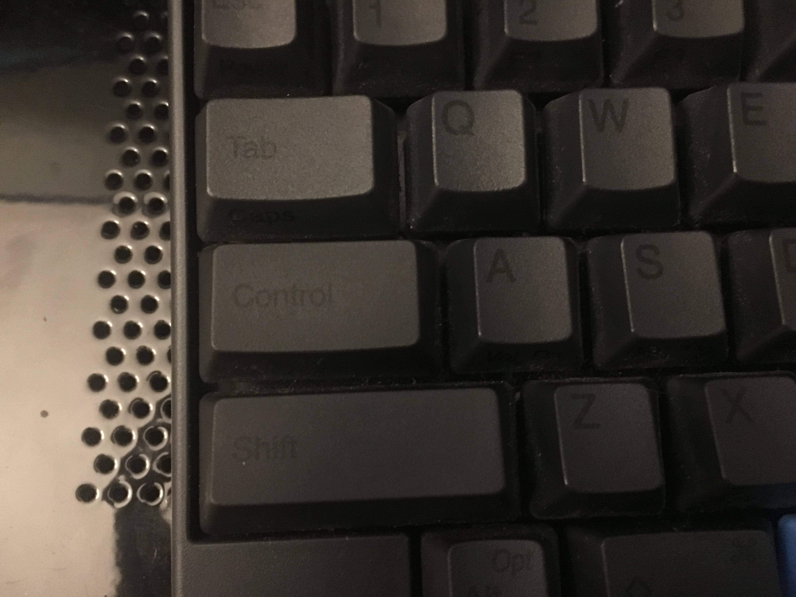
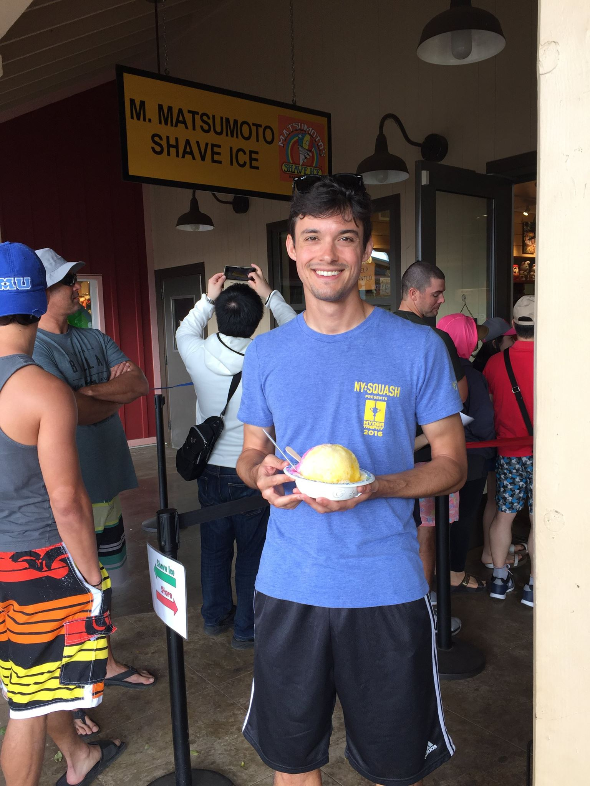
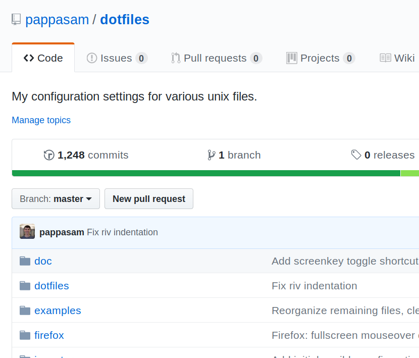
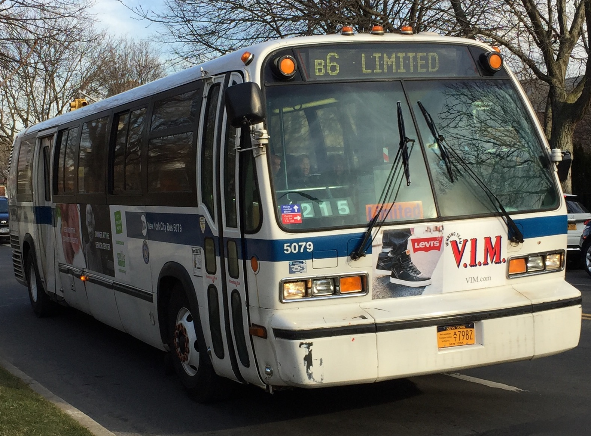
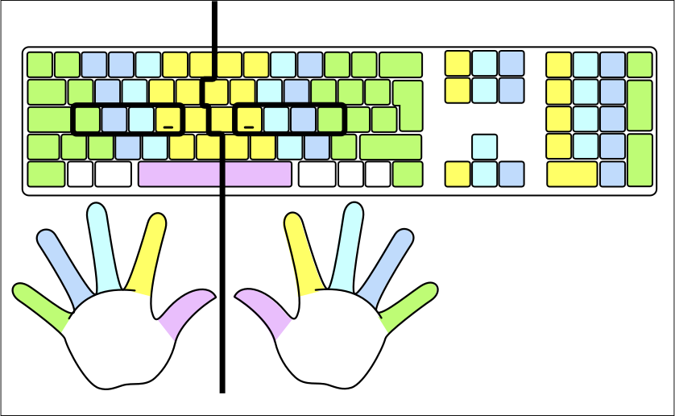
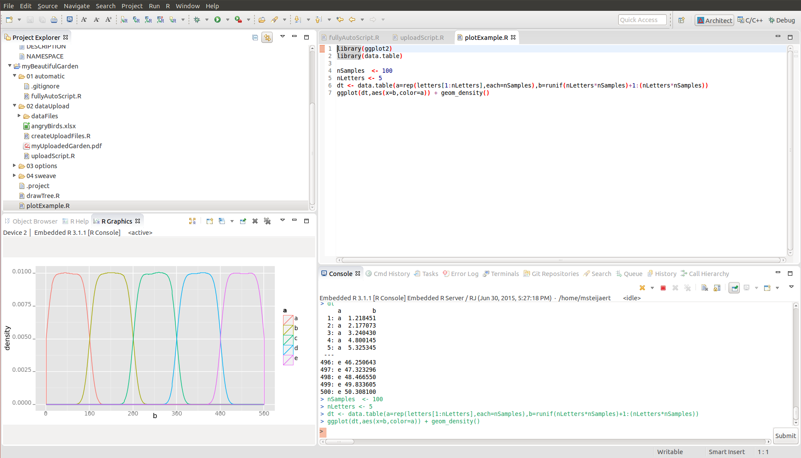
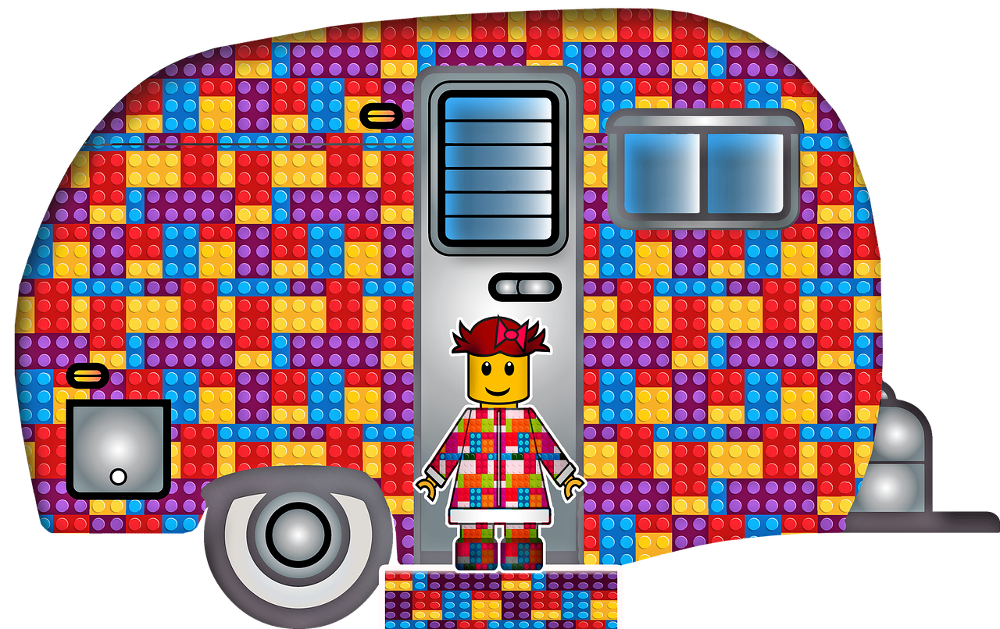

:data-transition-duration: 500
:skip-help: true
:css: style.css
:title: NYC Vim - Tmux

----

:data-x: r2000
:data-y: r0

Vim + Tmux
==========

A Terminal-based IDE
--------------------

Samuel Roeca; February 12, 2018

----

Thanks Def Method!!!
====================

----

Sam Roeca (Me)
==============

|sam|

.. note::

    * Grew up in Honolulu, Hawaii
    * Live in NYC
    * Play squash, ski, read books, program

----

Kepler Group
============

|kepler_logo|

.. note::

    * Head of Engineering, Kepler Group LLC

----

Vim NYC
=======

|vim_nyc|

.. note::

    * Meet like-minded peers
    * Share knowledge within
    * Spread knowledge without

----

Learning Goals
==============

* What is an IDE?
* What is Tmux?
* Hands-on demo

----

Non-Unix IDE
============

|ide_traditional|

.. note::

    * Source code editor
    * Build automation tools
    * Debugger

    Some:

    * Code completion
    * Compiler

    Source: Architect (data science)

----

Unix IDE
========

|lego_caravan|

.. note::

    'Unix programmers can combine command-line POSIX tools into a complete development environment, capable of developing large programs such as the Linux kernel and its environment.[8] In this sense, the entire Unix system functions as an IDE' - Wikipedia

----

**How beginners may feel about this...**

|legos_disorganized|

----

This talk...
============

|lego_hiker|

.. note::

    * Covers 1 lego piece

----

Quick Tips
==========

----

Type correctly
==============

|touch_typing|

*Resource: "Typing Club"*

.. note::

    * Learn to touch type

----

Caps Lock ==> Control
=====================

|capslock_control|

.. note::

    * Remap caps lock to control
    * Or buy happy hacking keyboard :p

----

Back Up / Version Dotfiles
==========================

|dotfiles|

.. note::

    * back up your configuration files

----

What is Tmux?
=============

----

Terminal Multiplexer
====================

**Multiplex**: Manifold; multiple (Webster 1913)

**Multiplexer**: In electronics, a multiplexer (or mux) is a device that combines several analog or digital input signals and forwards them into a single output line (Wikipedia)

----

Tmux Concepts
=============

|tmux_chart|

----

Tmux Alternatives?
==================

|wildflowers|

*Terminator, GNU Screen, I3, Vim*

.. note::

    There are many programs with overlapping functionality to Tmux

    Note: Tmux can be used with almost any tool, so "alternative" is a misnomer

----

Tmux + Alternatives
===================

|wildflower_bouquet|

----

Tmux Commands
=============

1. Tmux has "commands" (like Ex mode)
2. "Commands" are mapped to "keybindings"
3. The default "keybindings" are unpopular

----

Customization is Hard
=====================

|tailoring|

*But necessary for Tmux*

----

System Setup
============

.. code:: bash

    git clone https://github.com/pappasam/vim-tmux-tutorial
    cd vim-tmux-tutorial
    make

Begin: interactive demo

.. Begin: Image citations

.. Copyright Samuel Roeca 2019

.. Copyright Samuel Roeca + Elle Liu 2019

.. Copyright Samuel Roeca 2019

.. https://upload.wikimedia.org/wikipedia/commons/2/2a/MTA_Bus_5079_on_the_B6.jpg
.. Olsen24 [CC BY-SA 4.0 (https://creativecommons.org/licenses/by-sa/4.0)], from Wikimedia Commons

.. https://upload.wikimedia.org/wikipedia/commons/5/5a/Typing-colour_for-finger-positions.svg
.. Cy21 [CC BY-SA 3.0 (https://creativecommons.org/licenses/by-sa/3.0) or GFDL (http://www.gnu.org/copyleft/fdl.html)], from Wikimedia Commons

.. |tmux_chart| image:: ./instance/tmux-nesting.svg
    :height: 500px

.. https://upload.wikimedia.org/wikipedia/commons/a/a7/Screenshot_of_Architect_%28integrated_development_environment_for_data_science%29.png
.. Msteijaert [CC BY-SA 3.0 (https://creativecommons.org/licenses/by-sa/3.0)], via Wikimedia Commons

.. https://pixabay.com/en/lego-play-build-module-colorful-1629073/

.. https://pixabay.com/en/caravan-travel-trailer-lego-trailer-3818743/

.. https://pixabay.com/en/hiker-walker-rambler-lego-walk-1984421/
.. |lego_hiker| image:: ./img/hiker-1984421_1280.jpg
    :height: 500px

.. https://pixabay.com/en/tailoring-tailor-costume-apparel-2575930/

.. https://pbs.twimg.com/profile_images/2280848169/3swu6wfmqa78zugb07w3_400x400.png

.. https://pixabay.com/en/wildflowers-meadow-grass-plants-3571119/

.. https://pixabay.com/en/wildflowers-bouquet-dreamy-flowers-3422413/

.. End: Image citations
